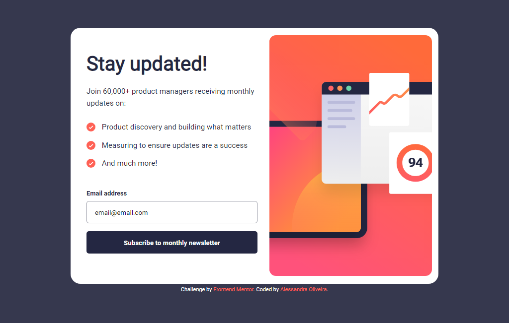
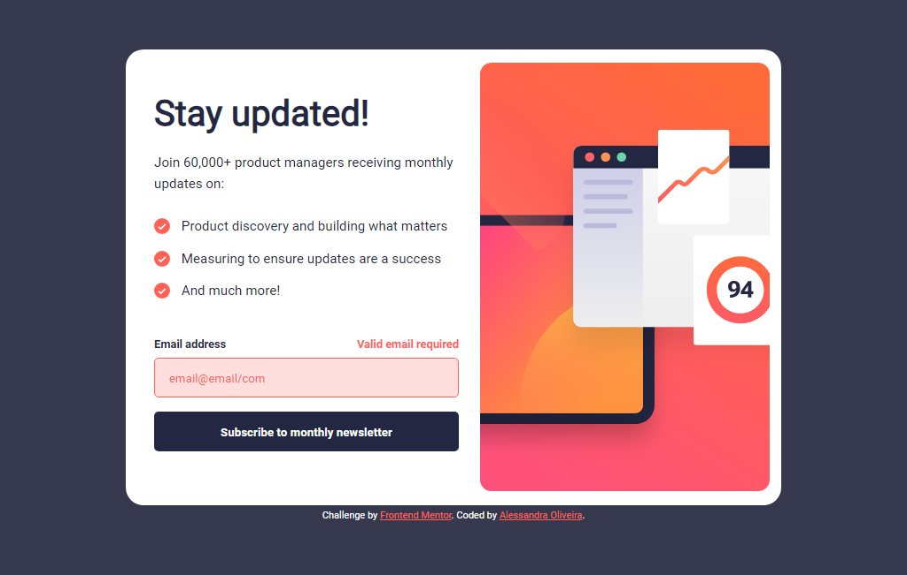
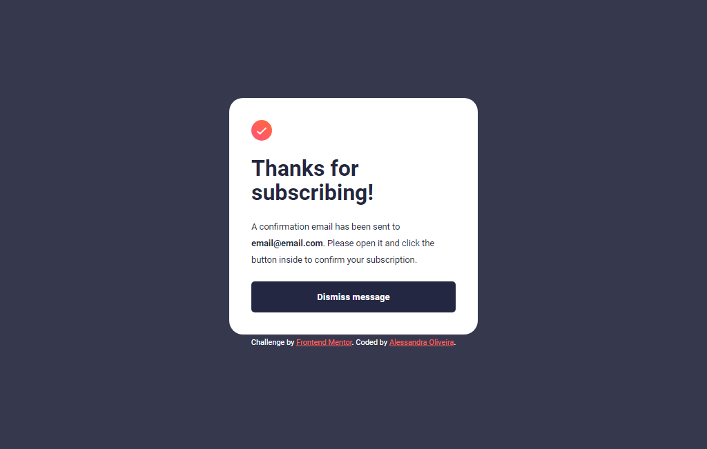
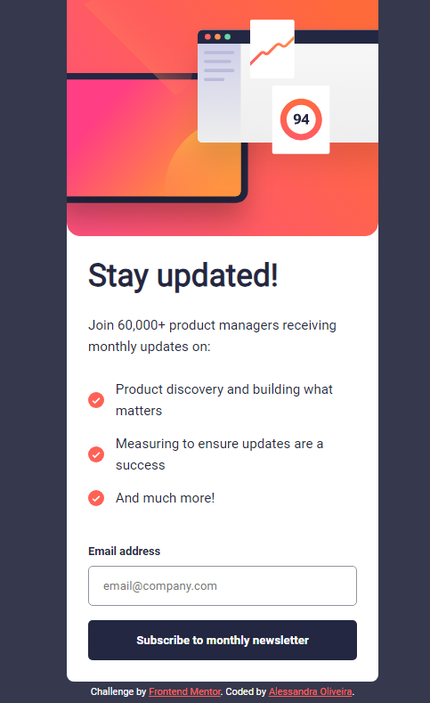
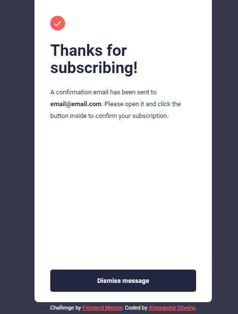

# Frontend Mentor - Newsletter sign-up form with success message solution

This is a solution to the [Newsletter sign-up form with success message challenge on Frontend Mentor](https://www.frontendmentor.io/challenges/newsletter-signup-form-with-success-message-3FC1AZbNrv). 

## Table of contents

- [Overview](#overview)
  - [The challenge](#the-challenge)
  - [Screenshot](#screenshot)
  - [Links](#links)
- [My process](#my-process)
  - [Built with](#built-with)
- [Author](#author)

## Overview

This is a solution to the newsletter sign-up form with success message challenge on frontend mentor. It was built entirely with HTML, CSS and JavaScript.

### The challenge

Users should be able to:

- Add their email and submit the form
- See a success message with their email after successfully submitting the form
- See form validation messages if:
  - The field is left empty
  - The email address is not formatted correctly
- View the optimal layout for the interface depending on their device's screen size
- See hover and focus states for all interactive elements on the page

### Screenshot

**Desktop solution:**

  

**Desktop solution (error state):**

  

**Desktop solution (success state):**

  

**Mobile solution:**

  

**Mobile solution (success state):**

  

### Links

- Solution URL: [Solution on Frontend Mentor](https://www.frontendmentor.io/solutions/ping-coming-soon-page-master-solution-_Enouy32ih)
- Live Site URL: [Live solution with Github Pages](https://itsale-o.github.io/ping-coming-soon-page-master/)

## My process

### Built with

- Semantic HTML5 markup
- CSS custom properties
- Flexbox
- CSS Grid
- JavaScript
  
## Author

- LinkedIn - [Alessandra Oliveira](https://www.linkedin.com/in/alessandra-santos-oliveira/)
- Frontend Mentor - [@itsale-o](https://www.frontendmentor.io/profile/itsale-o)
- Twitter - [@itsale_o](https://www.twitter.com/itsale_o)
